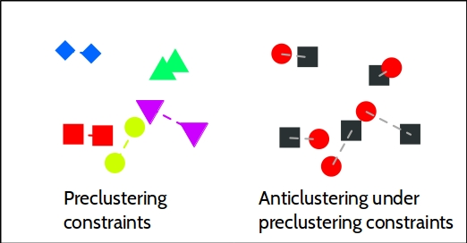

# Anticlustering

Anticlustering creates sets of elements that are as similar as possible
[@spath1986; @valev1998]. The better known twin of anticlustering is
cluster analysis that is used to create sets where elements within each
cluster are similar, but dissimilar from elements in other clusters. The
`R` package `anticlust` provides functions to tackle anticlustering
algorithmically.

```{r setup, include = FALSE}
library("knitr")
library("anticlust")
library("dplyr")

knitr::opts_chunk$set(
  collapse = TRUE,
  comment = "#>",
  fig.align = "center",
  fig.cap = "",
  message = FALSE,
  warning = FALSE
)

## Function to print descriptive statistics by anticluster
print_table <- function(features, anticlusters) {
  features$Anticluster <- anticlusters
  M <- features %>%
    group_by(Anticluster) %>%
    summarize_all(list(mean)) %>%
    round(2)
  SD <- features %>%
    group_by(Anticluster) %>%
    summarize_all(list(sd)) %>%
    round(2)
  tab <- rbind(M, SD)
  tab_ <- apply(tab[, -1], 2, prmisc::force_decimals)
  n_clusters <- length(unique(anticlusters))
  empty <- rep("", n_clusters - 1)
  funrow <- c("Mean", empty, "SD", empty)
  kable(data.frame(Statistic = funrow, tab_, Anticluster = tab$Anticluster))
}

set.seed(12345)
```

## Installation

```R
library("devtools") # if not available: install.packages("devtools")
install_github("m-Py/anticlust")
```

```{r}
# load the package via
library("anticlust")
```

## A quick start

The main function of the package is `anticlustering`. For most users, it
should be sufficient to know this function. It takes as input a data
table describing the elements we want to assign to groups. In the data
table, each row is an element, for example a person, picture, word, or a
photo. Each column is a numeric variable describing one of the elements'
features. The table may be an R `matrix` or `data.frame`; a single
feature can also be passed as a `vector`.

To illustrate the usage of the `anticlustering` function, we use the
classical iris data set describing the characteristics of 150 iris
plants:

```{r}
## Select only the numeric attributes
features <- iris[, -5]
nrow(features)
```

The first rows of the data set look as follows:

```{r, echo = FALSE}
kable(head(features))
```

We now use the `anticlustering` function to create two similar groups
of iris plants:

```{r}
anticlusters <- anticlustering(features, K = 2, standardize = TRUE)
anticlusters
table(anticlusters)
```

Now, we wish to know how well the anticluster assignment worked. To get
an intuition for how an anticluster looks like, we first plot the
plants' characteristics by anticluster:

```{r, fig.width = 6.5}
par(mfrow = c(1, 2))
pch <- 15:16
# plot_clusters is also a function of the anticlust package
plot_clusters(features[, 1:2], anticlusters, pch = pch) 
plot_clusters(features[, 3:4], anticlusters, pch = pch)

```

This looks rather chaotic, but it is probably what we want: We want a
strong overlap in all of the plants' characteristics because the
anticlusters should be similar. In addition to visually inspecting the
anticlustering plots, we probably want to investigate the descriptive
statistics of the plants' characteristics by anticluster. Ideally, the
distribution of plant characteristics should be the same for each
anticluster. In the following, we see that the means and standard
deviations of the plants' features are very similar:

```{r, echo = FALSE}
print_table(features, anticlusters)
```

## The anticlustering objective

In the example above, the `anticlustering` function established
anticlusters that were very similar with regard to the mean of each
plant feature. However, it was just a side effect that group means
turned out to be similar -- the anticlustering method does not directly
minimize differences in groups means. Instead, anticlustering employs
two objectives that have been developed in the context of cluster
analysis: 

- the k-means "variance" objective [@spath1986; @valev1998] 
- the cluster editing "distance" objective [@bocker2013; @miyauchi2015; @grotschel1989]

The k-means objective is given by the sum of the squared errors between
cluster centers and individual data points [@jain2010]. The cluster
editing objective is the sum of pairwise distances within anticlusters.
Maximizing either of these objectives leads to similar groups, i.e.,
anticlusters. Minimization of the same objectives leads to a clustering,
i.e., elements are as similar as possible within a set and as different
as possible between sets. 

To vary the objective function, it is possible change the parameter
`objective`. To apply anticluster editing, use `objective = "distance"`,
(this is also the default). To maximize the k-means variance objective,
set `objective = "variance"`. In many cases, the results for the
`"variance"` objective (k-means) and the `"distance"` objective
(anticluster editing) will be quite similar.

```{r}
anticlusters <- anticlustering(features, K = 2, standardize = TRUE,
                               objective = "variance")
```

```{r, echo = FALSE}
print_table(features, anticlusters)
```

## Exact anticluster editing

Finding an optimal partitioning that maximizes the anticluster editing
or variance objective is computationally demanding. For anticluster
editing, the package `anticlust` still offers the possibility to find
the best possible partition, relying on [integer linear
programming](https://en.wikipedia.org/wiki/Integer_programming). This
exact approach relies on a formulation developed by @grotschel1989 that
has been used to rather efficiently solve the cluster editing problem
[@bocker2011]. To obtain an optimal solution, a linear programming
solver must be installed on the system. `anticlust` supports the
commercial solvers [gurobi](https://www.gurobi.com/) and
[CPLEX](https://www.ibm.com/analytics/cplex-optimizer) as well as the
open source [GNU linear programming
kit](https://www.gnu.org/software/glpk/glpk.html). The commercial
solvers are generally faster. Researchers can install a commercial
solver for free using an academic licence. To use any of the solvers
from within `R`, one of the interface packages `gurobi` (is shipped with
the software gurobi),
[Rcplex](https://CRAN.R-project.org/package=Rcplex) or
[Rglpk](https://CRAN.R-project.org/package=Rglpk) must also be
installed.

To find the optimal solution, we have to set the arguments `method =
"ilp"` and `preclustering = FALSE`:

```R
anticlustering(features, K = 2, method = "ilp", preclustering = FALSE)
```

Note that this approach will only work for small problem sizes (< 30
elements). We can increase the problem size that the integer linear
programming approach can handle by setting the argument `preclustering =
TRUE`. In this case, a cluster analysis is first performed, creating
small groups of elements that are very similar. The preclustering finds
pairs of similar stimuli if K = 2, triplets if K = 3, and so forth.
Then, a restriction is enforced that precludes very similar elements to
be assigned to the same set. This procedure is illustrated in the
following plot for K = 2 and n = 10:

```{r, out.width = '60%', echo = FALSE}

```

The preclustering restrictions improve the running time of the integer
linear programming solver by a large margin (often 100x as fast).
However, in some occasions, the restrictions prohibit the integer linear
programming solver to find the very best partitioning, because this may
be only obtained when some of the very similar preclustered elements are
assigned to thethe same group. But in general, the solution is still
very good and often optimal. This code can be used to employ integer
linear programming under preclustering constraints.

```R
anticlustering(features, K = 2, method = "ilp", preclustering = TRUE)
```

## Random search

To solve larger problem instances that cannot be processed using integer
linear programming, a heuristic method based on random sampling is
available. Across a user-specified number of runs (specified via the
argument `nrep`), each element is first randomly assigned to an
anticluster and then the objective value is computed. In the end, the
best assignment is returned as output. To activate the heuristic,  set
`method = "heuristic"` (this is also the default argument). When we set
`preclustering = TRUE`, the random assignment is conducted under the
restriction that preclustered elements cannot be part of the same
anticluster. 

## How to procede

The help page of the `anticlustering` function (`?anticlustering`)
provides additional explanations of all function parameters. Currently,
there is also a paper in preparation that will explain the theoretical
background of the `anticlust` package in detail.

## References
