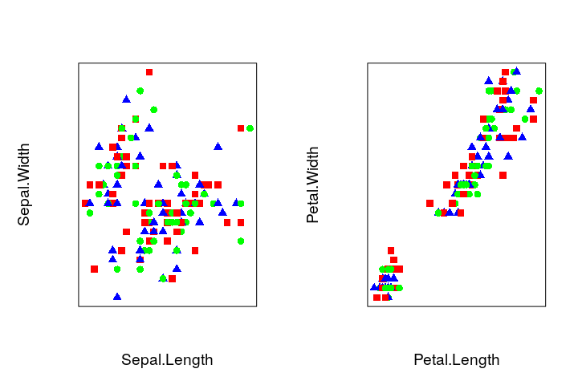
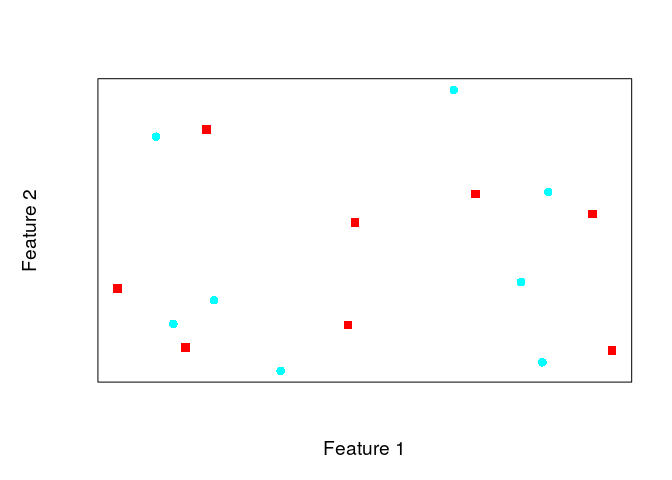

Using anticlustering to create equivalent sets
==============================================

Clustering algorithms establish groups of elements while ensuring that elements within each cluster are similar, but clearly separated from elements in other clusters. Anticlustering reverses this logic and creates groups (anticlusters) that are as similar as possible (Späth 1986; Valev 1998). The `R` package `anticlust` provides functions to tackle this problem algorithmically. I initially created this package to assign stimuli in psychological experiments to different conditions so that conditions are as equal as possible, a priori. But I am sure that a wide range of applications is possible (for an example, see section 'A quick start').

Installation
------------

``` r
library("devtools") # if not available: install.packages("devtools")
install_github("m-Py/anticlust")
```

``` r
# load the package via 
library("anticlust")
```

A quick start
-------------

The main function of the package is `anticlustering`. For most users, it should be sufficient to know this function. It takes as input a data matrix of features describing the elements that we want to assign to groups.\[^1\] In the data matrix, each row is an element, for example a person, picture, word, or a photo. Each column is a numeric variable describing one of the elements' features.

To illustrate the usage of the function, we use the classical iris data set describing the characteristics of 150 iris plants:

``` r
## Select only the numeric attributes
data <- iris[, -5]
nrow(data)
#> [1] 150

## Illustrate the data set
library("knitr")
kable(head(data))
```

|  Sepal.Length|  Sepal.Width|  Petal.Length|  Petal.Width|
|-------------:|------------:|-------------:|------------:|
|           5.1|          3.5|           1.4|          0.2|
|           4.9|          3.0|           1.4|          0.2|
|           4.7|          3.2|           1.3|          0.2|
|           4.6|          3.1|           1.5|          0.2|
|           5.0|          3.6|           1.4|          0.2|
|           5.4|          3.9|           1.7|          0.4|

We now use the `anticlustering` function to create three similar groups of iris plants:

``` r
library("anticlust")
n_clusters <- 3
anticlusters <- anticlustering(data, n_clusters)
anticlusters
#>   [1] 1 1 3 2 3 1 2 2 2 2 3 3 2 1 2 1 2 2 3 3 1 1 3 1 2 3 2 1 1 2 3 2 3 2 1
#>  [36] 3 3 1 3 3 3 1 1 1 1 3 2 1 2 2 1 2 3 2 2 1 3 3 2 1 3 1 3 1 1 1 3 1 1 2
#>  [71] 3 1 3 2 3 1 3 3 3 1 1 3 3 3 2 1 2 3 3 3 2 2 2 2 3 1 2 2 1 2 2 3 2 1 3
#> [106] 3 3 3 1 3 2 2 1 2 3 2 1 1 2 2 1 1 1 1 2 1 2 1 3 3 1 2 1 2 1 2 3 3 3 3
#> [141] 1 2 3 3 1 2 2 2 1 2
table(anticlusters)
#> anticlusters
#>  1  2  3 
#> 50 50 50
```

The vector `anticlusters` contains the anticluster affiliation of each plant. The `anticlustering` function created an equal number of plants per anticluster. Currently, it is not possible to create anticlusters of different sizes.

Next, we wish to know how well the anticluster assignment worked. To find out, we first plot the plants' characteristics by anticluster:

``` r
par(mfrow = c(1, 2))
pch <- c(15, 16, 17)
plot_clusters(data[, 1:2], anticlusters, pch = pch) # a function of the anticlust package
plot_clusters(data[, 3:4], anticlusters, pch = pch)
```



This looks rather chaotic, but it is probably what we want: We would expect a strong overlap in all of the plants' characteristics between the three anticlusters. In constrast, a clustering of plants would have created a strong separation between groups, as can be seen in the following example:

``` r
clusters <- clustering(data, n_clusters) # a function of the anticlust package

par(mfrow = c(1, 2))
plot_clusters(data[, 1:2], clusters, pch = pch)
plot_clusters(data[, 3:4], clusters, pch = pch)
```


As the name suggests, anticlustering is the reversal of clustering. Instead of *separating* groups as well as possible, we create a *strong overlap* between groups; anticlusters should at best be indistinguishable.

In addition to visually inspecting the anticlustering plots, we probably want to investigate the descriptive statistics of the plants' characteristics by anticluster. This gives us some intuition about how well the anticluster assignment worked. Ideally, the distribution of plant characteristics should be the same for each anticluster. The following code example prints the mean values of each plant feature by anticluster:

``` r
library("dplyr")

data <- data.frame(Anticluster = anticlusters, data)
data %>%
  group_by(Anticluster) %>%
  summarize_all(funs(mean)) %>%
  round(2) %>%  knitr::kable()
```

|  Anticluster|  Sepal.Length|  Sepal.Width|  Petal.Length|  Petal.Width|
|------------:|-------------:|------------:|-------------:|------------:|
|            1|          5.86|         3.08|          3.75|          1.2|
|            2|          5.87|         3.07|          3.75|          1.2|
|            3|          5.80|         3.03|          3.77|          1.2|

A completely random assignment very likely produces a much worse grouping, as is illustrated by the following code:

``` r
## Randomly assign plants to anticlusters
data$Anticluster <- rep(1:n_clusters, nrow(data) / n_clusters)
data$Anticluster <- sample(data$Anticluster)

data %>%
  group_by(Anticluster) %>%
  summarize_all(funs(mean)) %>%
  round(2) %>% knitr::kable()
```

|  Anticluster|  Sepal.Length|  Sepal.Width|  Petal.Length|  Petal.Width|
|------------:|-------------:|------------:|-------------:|------------:|
|            1|          5.97|         3.04|          4.05|         1.27|
|            2|          5.89|         2.93|          4.02|         1.33|
|            3|          5.68|         3.20|          3.21|         1.00|

The anticlustering objective
----------------------------

In the example above, the `anticlustering` function established anticlusters that were very similar with regard to the mean of each plant feature, outperforming a simple random allocation. However, it was just a side effect that group means turned out to be similar -- the anticlustering method does not directly minimize differences in groups means. Instead, anticlustering operates on measures of group similarity that have been developed in the context of cluster analysis; `anticlust` adapts two clustering methods: k-means (Späth 1986; Valev 1998) and cluster editing (Böcker and Baumbach 2013). The vignette "Technical notes" that is included with the package discusses the objectives of these clustering methods in more detail, but a short primer is given here:

K-means is probably the best-known cluster algorithm. K-Means tries to minimize the within-cluster variance of feature values across a pre-specified number of clusters (*k*) (Jain 2010). Späth (1986) and Valev (1998) proposed to maximize the variance criterion for the anticlustering application. The basic unit underlying the cluster editing objective is a measure *d*<sub>*i**j*</sub> quantifying the dissimilarity between two elements *i* and *j*, for example as the common Euclidean distance.[1] The optimal cluster editing objective is found when the sum of pairwise within-cluster dissimilarities is minimized (Miyauchi and Sukegawa 2015; Grötschel and Wakabayashi 1989). Adapting the cluster editing objective to anticlustering, the package `anticlust` maximizes the sum of all pairwise euclidean distances within anticlusters. This approach maximizes group similarity as measured by the average linkage method employed in hierarchical clustering methods.

To vary the objective function in `anticlust`, it is possible change the parameter `objective` in the function `anticlustering`. In most cases, the results for the `"variance"` objective (k-means) and the `"distance"` objective (cluster editing) will be quite similar. The default objective is `"distance"`; you can change it to `"variance"` as follows:

``` r
data <- iris[, -5]
data$Anticluster <- anticlustering(data, n_clusters, objective = "variance")

## Display feauture means by anticluster for the variance criterion
data %>%
  group_by(Anticluster) %>%
  summarize_all(funs(mean)) %>%
  round(2) %>% knitr::kable()
```

|  Anticluster|  Sepal.Length|  Sepal.Width|  Petal.Length|  Petal.Width|
|------------:|-------------:|------------:|-------------:|------------:|
|            1|          5.84|         3.07|          3.73|         1.18|
|            2|          5.84|         3.05|          3.79|         1.21|
|            3|          5.85|         3.05|          3.75|         1.20|

An exact approach
-----------------

Finding an optimal partioning that maximizes the distance or variance criterion is computationally hard. For the distance criterion, the package `anticlust` offers the possibility to find the best possible partition, relying on [integer linear programming](https://en.wikipedia.org/wiki/Integer_programming). The exact approach relies on an algorithm developed by Grötschel and Wakabayashi (1989) that can be used to rather efficiently solve the cluster editing problem exactly (Böcker, Briesemeister, and Klau 2011). To use obtain an optimal solution, a linear programming solver must be installed on your system; `anticlust` supports the commercial solvers [gurobi](https://www.gurobi.com/) and [CPLEX](https://www.ibm.com/analytics/cplex-optimizer) as well as the open source [GNU linear programming kit](https://www.gnu.org/software/glpk/glpk.html). The commercial solvers are generally faster. Researchers can install a commercial solver for free using an academic licence. To use any of the solvers from within `R`, one of the interface packages `gurobi` (is shipped with the software gurobi), [Rcplex](https://CRAN.R-project.org/package=Rcplex) or [Rglpk](https://CRAN.R-project.org/package=Rglpk) must also be installed.

To find the optimal solution, we have to set the arguments `method = "exact"` and `preclustering = FALSE` and `objective = "distance"` (the latter is the default argument, however)

``` r
# Create random data to illustrate exact solution
features <- matrix(runif(32), ncol = 2)
anticlusters <- anticlustering(features, n_anticlusters = 2,
                               method = "exact", preclustering = FALSE,
                               objective = "distance")
plot_clusters(features, anticlusters, pch = 15:16)
```



``` r
# see ?anticlustering
```

Note that this approach will only work for small problem sizes (maybe &lt; 30 elements). Finding an optimal partitioning of elements into sets is computationally difficult. For example, there are `r minDiff:::all_combinations(c(10, 10))` possibilities to partition 20 elements into 2 groups. The number of possible partitions grows exponentially with the number of elements. There are `r minDiff:::all_combinations(c(20, 20))` possibilities to assign 40 elements to 2 groups and there are 5.778312110^{26} possibilities to assign 60 elements to 3 groups.

Optimal clustering
------------------

We can also use the exact approach to obtain an optimal clustering that minimizes the distance criterion while ensuring an equal cluster size:

How to procede
--------------

If you are already happy with the results provided by the `anticlustering` function, you may stop here. The help page (`?anticlustering`) explains all of the parameters that can be adjusted for the `anticlusting` function. Currently, there is also a paper in preparation that will explain the theoretical background of the `anticlust` package in detail

References
----------

Böcker, Sebastian, and Jan Baumbach. 2013. “Cluster Editing.” In *Conference on Computability in Europe*, 33–44. Springer.

Böcker, Sebastian, Sebastian Briesemeister, and Gunnar W Klau. 2011. “Exact Algorithms for Cluster Editing: Evaluation and Experiments.” *Algorithmica* 60 (2). Springer: 316–34.

Demaine, Erik D, Dotan Emanuel, Amos Fiat, and Nicole Immorlica. 2006. “Correlation Clustering in General Weighted Graphs.” *Theoretical Computer Science* 361 (2-3). Elsevier: 172–87.

Grötschel, Martin, and Yoshiko Wakabayashi. 1989. “A Cutting Plane Algorithm for a Clustering Problem.” *Mathematical Programming* 45 (1-3). Springer: 59–96.

Jain, Anil K. 2010. “Data Clustering: 50 Years Beyond K-Means.” *Pattern Recognition Letters* 31 (8). Elsevier: 651–66.

Miyauchi, Atsushi, and Noriyoshi Sukegawa. 2015. “Redundant Constraints in the Standard Formulation for the Clique Partitioning Problem.” *Optimization Letters* 9 (1). Springer: 199–207.

Späth, H. 1986. “Anticlustering: Maximizing the Variance Criterion.” *Control and Cybernetics* 15 (2): 213–18.

Valev, Ventzeslav. 1998. “Set Partition Principles Revisited.” In *Joint IAPR International Workshops on Statistical Techniques in Pattern Recognition (SPR) and Structural and Syntactic Pattern Recognition (SSPR)*, 875–81. Springer.

[1] Similarity measures can be used as well, in which case larger values indicate higher similarity (Demaine et al. 2006).
