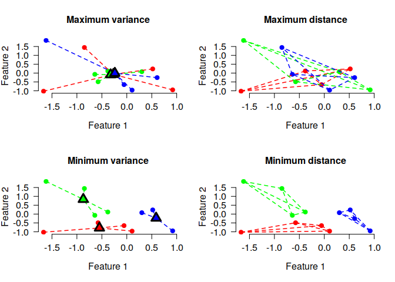

anticlust 
=======================================================================================================================================

Anticlustering partitions a pool of elements into subsets (i.e.,
anticlusters) in such a way that the subsets are as similar as possible.
This is accomplished by maximizing instead of minimizing a clustering
objective function, such as the intra-cluster variance (used in k-means
clustering) or the sum of pairwise distances within clusters. Thus,
anticlustering creates similar sets of elements by maximizing
heterogeneity within anticlusters. The package `anticlust` implements
anticlustering algorithms as described in Papenberg and Klau (2020;
<a href="https://doi.org/10.1037/met0000301" class="uri">https://doi.org/10.1037/met0000301</a>).
It was originally developed to assign items to experimental conditions
in experimental psychology, but it can be applied whenever a user
requires that a given set of elements has to be partitioned into similar
subsets, or when the within-group heterogeneity should be high.

Installation
------------

The stable release of `anticlust` is available from
[CRAN](https://CRAN.R-project.org/package=anticlust) and can be
installed via:

    install.packages("anticlust")

A (potentially more recent) version of anticlust can also be installed
directly via Github:

    library("remotes") # if not available: install.packages("remotes")
    install_github("m-Py/anticlust")

If you like, you can also install the current (unstable) development
version:

    library("remotes") # if not available: install.packages("remotes")
    install_github("m-Py/anticlust", ref = "devel")

[Here](https://github.com/m-Py/anticlust/blob/devel/NEWS.md) you may
find some hints on the most recent additions to the development version.

Citation
--------

If you use `anticlust` in your research, it would be courteous if you
cite the following reference:

Papenberg, M., & Klau, G. W. (2021). Using anticlustering to partition data sets into equivalent parts. *Psychological Methods, 26*(2), 161–174.
<a href="https://doi.org/10.1037/met0000301" class="uri">https://doi.org/10.1037/met0000301</a>.

How do I learn about `anticlust`
--------------------------------

This README contains some basic information on the `R` package
`anticlust`. More information is available via the following sources:

-   A paper is available describing the theoretical background of
    anticlustering and the `anticlust` package in detail
    (<a href="https://doi.org/10.1037/met0000301" class="uri">https://doi.org/10.1037/met0000301</a>).
    The freely available preprint can be retrieved from
    <a href="https://psyarxiv.com/3razc/" class="uri">https://psyarxiv.com/3razc/</a>.

-   The [package website](https://m-py.github.io/anticlust/) contains
    all relevant documentation. This includes a
    [vignette](https://m-py.github.io/anticlust/articles/stimulus-selection.html)
    detailing how to use the anticlust package for stimulus selection in
    experiments and documentation for the main `anticlust` functions
    `anticlustering()`, `balanced_clustering()` and `matching()`.

A quick start
-------------

In this initial example, I use the main function `anticlustering()` to
create three similar sets of plants using the classical iris data set:

    # load the package via
    library("anticlust")

    anticlusters <- anticlustering(
      iris[, -5],
      K = 3,
      objective = "variance",
      method = "exchange"
    )

    ## The output is a vector that assigns a group (i.e, a number 
    ## between 1 and K) to each input element:
    anticlusters
    #>   [1] 1 1 2 3 2 2 1 3 1 3 1 2 3 2 1 3 1 3 3 1 2 3 1 3 3 2 2 2 2 2 3 2 3 2 1 3 2
    #>  [38] 2 1 2 1 3 2 1 1 1 3 1 3 3 3 1 1 2 3 3 1 3 1 2 3 3 1 2 2 1 1 2 2 3 1 1 3 3
    #>  [75] 2 1 3 3 1 3 1 2 1 2 1 2 3 1 1 3 2 1 2 1 1 2 1 2 3 3 3 2 2 3 3 2 1 1 2 1 3
    #> [112] 2 2 3 2 2 1 3 1 1 1 2 1 3 2 3 1 3 3 2 1 2 3 2 3 3 1 2 2 1 2 2 1 3 3 3 2 2
    #> [149] 1 3

    ## Each group has the same number of items:
    table(anticlusters)
    #> anticlusters
    #>  1  2  3 
    #> 50 50 50

    ## Compare the feature means by anticluster:
    by(iris[, -5], anticlusters, function(x) round(colMeans(x), 2))
    #> anticlusters: 1
    #> Sepal.Length  Sepal.Width Petal.Length  Petal.Width 
    #>         5.84         3.06         3.76         1.20 
    #> ------------------------------------------------------------ 
    #> anticlusters: 2
    #> Sepal.Length  Sepal.Width Petal.Length  Petal.Width 
    #>         5.84         3.06         3.76         1.20 
    #> ------------------------------------------------------------ 
    #> anticlusters: 3
    #> Sepal.Length  Sepal.Width Petal.Length  Petal.Width 
    #>         5.84         3.06         3.76         1.20

As illustrated in the example, we can use the function
`anticlustering()` to create similar sets of elements. In this case
“similar” primarily means that the mean values of the variables are
pretty much the same across three groups. The function
`anticlustering()` takes as input a data table describing the elements
that should be assigned to sets. In the data table, each row represents
an element, for example a person, word or a photo. Each column is a
numeric variable describing one of the elements’ features. The table may
be an R `matrix` or `data.frame`; a single feature can also be passed as
a `vector`. The number of groups is specified through the argument `K`.
(Alternatively, it is also possible to pass a dissimilarity matrix
describing the pairwise distance between elements.)

To quantify set similarity, `anticlust` may employ one of two measures
that have been developed in the context of cluster analysis:

-   the k-means “variance” objective
-   the cluster editing “diversity” objective

The k-means objective is given by the sum of the squared distances
between cluster centers and individual data points. The cluster editing
objective is the sum of pairwise distances within each anticluster. The
following plot illustrates both objectives for 12 elements that have
been assigned to three sets. Each element is described by two numeric
features, displayed as the *x* and *y* axis:

The lines connecting the dots illustrate the values that enter the
objective functions. For (anti)cluster editing (“diversity objective”,
plots on the right side), lines are drawn between pairs of elements
within the same cluster, because the objective is the sum of the
pairwise distances between elements that are part of the same cluster.
For k-means (anticlustering) (“variance objective”, plots on the left
side ), lines are drawn connecting eech element and the centroid of the
cluster to which the element is assigned, because the objective is the
sum of the squared distances between cluster centers and elements.

Minimizing either the diversity or the variance objective creates three
distinct clusters of elements (as shown in the lower plots), whereas
maximization leads to a strong overlap of the three sets, i.e., three
anticlusters (as shown in the upper plots).

To vary the objective function in the `anticlust` package, we can change
the parameter `objective`. To use anticluster editing, use
`objective = "diversity"` (this is also the default). To maximize the
k-means variance objective, set `objective = "variance"`.

Categorical constraints
-----------------------

Sometimes, it is required that sets are not only similar with regard to
some numeric variables, but we also want to ensure that each set
contains an equal number of elements of a certain category. Coming back
to the initial iris data set, we may want to require that each set has a
balanced number of plants of the three iris species. To this end, we can
use the argument `categories` as follows:

    anticlusters <- anticlustering(
      iris[, -5],
      K = 3,
      objective = "variance",
      method = "exchange",
      categories = iris[, 5]
    )

    ## The species are as balanced as possible across anticlusters:
    table(anticlusters, iris[, 5])
    #>             
    #> anticlusters setosa versicolor virginica
    #>            1     17         17        16
    #>            2     17         16        17
    #>            3     16         17        17

Matching and clustering
-----------------------

Anticlustering in a sense creates sets of dissimilar elements; the
heterogenity within anticlusters is maximized (either using the cluster
editing or k-means objective as measure of heterogenity). The
`anticlust` package also provides functions for “classical” clustering
applications: `balanced_clustering()` creates sets of elements that are
similar while ensuring that clusters are of equal size. This is an
example:

    # Generate random data, cluster the data set and visualize results
    N <- 1000
    lds <- data.frame(var1 = rnorm(N), var2 = rnorm(N))
    cl <- balanced_clustering(lds, K = 10)
    plot_clusters(lds, clusters = cl, show_axes = TRUE)

The function `matching()` is very similar, but is usually used to find
small groups of similar elements, e.g., triplets as in this example:

    # Generate random data and find triplets of similar elements:
    N <- 120
    lds <- data.frame(var1 = rnorm(N), var2 = rnorm(N))
    triplets <- matching(lds, p = 3)
    plot_clusters(
      lds,
      clusters = triplets,
      within_connection = TRUE,
      show_axes = TRUE
    )

Questions and suggestions
-------------------------

If you have any question on the `anticlust` package or any suggestions
(which are greatly appreciated), I encourage you to contact me via email
(<a href="mailto:martin.papenberg@hhu.de" class="email">martin.papenberg@hhu.de</a>)
or [Twitter](https://twitter.com/MPapenberg), or to open an [issue on
the Github repository](https://github.com/m-Py/anticlust/issues).
