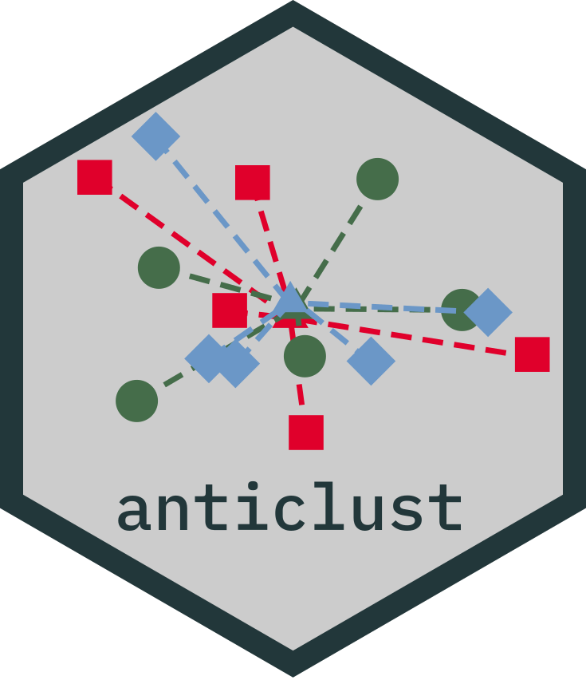
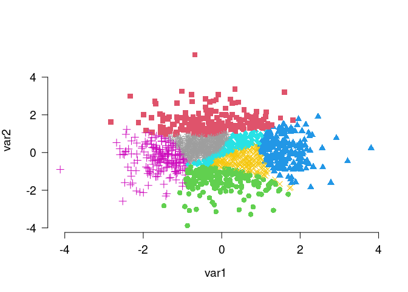
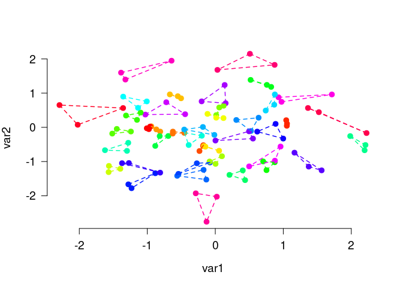

# anticlust 

Anticlustering partitions a pool of elements into clusters (or
*anticlusters*) with the goal of achieving high between-cluster
similarity and high within-cluster heterogeneity. This is accomplished
by maximizing instead of minimizing a clustering objective function,
such as the intra-cluster variance (used in k-means clustering) or the
sum of pairwise distances within clusters. The package `anticlust`
implements anticlustering methods as described in Papenberg and Klau
(2021; <https://doi.org/10.1037/met0000301>), Brusco et al. (2020;
<https://doi.org/10.1111/bmsp.12186>), and Papenberg (in press;
preprint: <https://doi.org/10.31234/osf.io/7jw6v>).

## Installation

The stable release of `anticlust` is available from
[CRAN](https://CRAN.R-project.org/package=anticlust) and can be
installed via:

    install.packages("anticlust")

A (potentially more recent) version of `anticlust` can also be installed
directly via Github:

    library("remotes") # if not available: install.packages("remotes")
    install_github("m-Py/anticlust")

## Citation

If you use `anticlust` in your research, it would be courteous if you
cite the following reference:

-   Papenberg, M., & Klau, G. W. (2021). Using anticlustering to
    partition data sets into equivalent parts. *Psychological Methods,
    26*(2), 161–174. <https://doi.org/10.1037/met0000301>

Depending on which `anticlust` functions you are using, including other
references may also be fair. [Here you can find out in detail how to
cite `anticlust`](HOW_TO_CITE_ANTICLUST.md).

Another great way of showing your appreciation of `anticlust` is to
leave a star on this Github repository.

## How do I learn about `anticlust`

This README contains some basic information on the `R` package
`anticlust`. More information is available via the following sources:

-   A paper is available describing the theoretical background of
    anticlustering and the `anticlust` package in detail
    (<https://doi.org/10.1037/met0000301>). The freely available
    preprint can be retrieved from <https://psyarxiv.com/3razc/>. A more
    recent paper focusing on the k-plus anticlustering method can be
    retrieved from <https://psyarxiv.com/7jw6v/>.
-   The `R` documentation of the main functions is actually quite rich
    and up to date, so you should definitely check that out when using
    the `anticlust` package (primarily `?anticlustering`,
    `?kplus_anticlustering`, `?balanced_clustering`, and `?matching`).
-   A [video](https://youtu.be/YGrhSmi1oA8) is available in German
    language where I illustrate the main functionalities of the
    `anticlustering()` function. My plan is to make a similar video in
    English in the future.
-   The [package website](https://m-py.github.io/anticlust/) contains
    all documentation as a convenient website. At the current time, the
    website also lists three package vignettes, while additional
    vignettes are planned.

## A quick start

In this initial example, I use the main function `anticlustering()` to
create five similar sets of plants using the classical iris data set:

First, load the package via

    library("anticlust")

Call the `anticlustering()` method:

    anticlusters <- anticlustering(
      iris[, -5],
      K = 5,
      objective = "kplus",
      method = "local-maximum",
      repetitions = 10
    )

The output is a vector that assigns a group (i.e, a number between 1 and
`K`) to each input element:

    anticlusters
    #>   [1] 1 2 2 5 5 4 3 4 4 5 1 1 2 1 2 5 3 5 3 1 5 2 1 3 5 3 3 4 3 1 2 4 2 3 1 4 5
    #>  [38] 4 5 3 1 2 2 4 1 4 2 3 5 4 2 4 2 2 3 4 2 5 3 3 1 5 4 1 5 1 2 3 1 3 2 2 4 4
    #>  [75] 5 4 1 5 5 2 4 3 3 5 5 1 2 1 5 4 2 1 5 4 3 3 4 3 1 5 4 2 1 2 1 2 3 1 2 4 2
    #> [112] 5 4 2 3 1 4 3 3 5 3 4 5 4 1 5 2 4 3 3 4 4 5 1 1 5 5 2 1 2 3 1 3 5 2 1 5 3
    #> [149] 4 1

By default, each group has the same number of elements (but the argument
`K` can be adjusted to request different group sizes):

    table(anticlusters)
    #> anticlusters
    #>  1  2  3  4  5 
    #> 30 30 30 30 30

Last, let’s compare the features’ means and standard deviations across
groups to find out if the five groups are similar to each other:

    knitr::kable(mean_sd_tab(iris[, -5], anticlusters), row.names = TRUE)

<table>
<thead>
<tr class="header">
<th style="text-align: left;"></th>
<th style="text-align: left;">Sepal.Length</th>
<th style="text-align: left;">Sepal.Width</th>
<th style="text-align: left;">Petal.Length</th>
<th style="text-align: left;">Petal.Width</th>
</tr>
</thead>
<tbody>
<tr class="odd">
<td style="text-align: left;">1</td>
<td style="text-align: left;">5.84 (0.84)</td>
<td style="text-align: left;">3.06 (0.44)</td>
<td style="text-align: left;">3.76 (1.79)</td>
<td style="text-align: left;">1.20 (0.77)</td>
</tr>
<tr class="even">
<td style="text-align: left;">2</td>
<td style="text-align: left;">5.84 (0.84)</td>
<td style="text-align: left;">3.06 (0.44)</td>
<td style="text-align: left;">3.76 (1.79)</td>
<td style="text-align: left;">1.20 (0.77)</td>
</tr>
<tr class="odd">
<td style="text-align: left;">3</td>
<td style="text-align: left;">5.84 (0.84)</td>
<td style="text-align: left;">3.06 (0.45)</td>
<td style="text-align: left;">3.75 (1.79)</td>
<td style="text-align: left;">1.20 (0.77)</td>
</tr>
<tr class="even">
<td style="text-align: left;">4</td>
<td style="text-align: left;">5.84 (0.84)</td>
<td style="text-align: left;">3.06 (0.44)</td>
<td style="text-align: left;">3.75 (1.79)</td>
<td style="text-align: left;">1.20 (0.77)</td>
</tr>
<tr class="odd">
<td style="text-align: left;">5</td>
<td style="text-align: left;">5.85 (0.84)</td>
<td style="text-align: left;">3.06 (0.44)</td>
<td style="text-align: left;">3.76 (1.79)</td>
<td style="text-align: left;">1.19 (0.77)</td>
</tr>
</tbody>
</table>

As illustrated in the example, we can use the function
`anticlustering()` to create similar groups of plants. In this case
“similar” primarily means that the means and standard deviations (in
parentheses) of the variables are pretty much the same across the five
groups. The function `anticlustering()` takes as input a data table
describing the elements that should be assigned to sets. In the data
table, each row represents an element (here a plant, but it can be
anything; for example a person, word, or a photo). Each column is a
numeric variable describing one of the elements’ features. The number of
groups is specified through the argument `K`. The argument `objective`
specifies how between-group similarity is quantified; the argument
`method` specifies the algorithm by which this measure is optimized. See
the documentation `?anticlustering` for more details.

Four anticlustering objectives are natively supported in
`anticlustering()`:

-   the “diversity” objective, setting `objective = "diversity"`
    (default)
-   the k-means objective (i.e., the “variance”) setting
    `objective = "variance"`
-   the “k-plus” objective, an extension of the k-means variance
    criterion, setting `objective = "kplus"`
-   the “dispersion” objective (the minimum distance between any two
    elements within the same cluster), setting
    `objective = "dispersion"`

The anticlustering objectives are described in detail in the
documentation (`?diversity_objective`, `?variance_objective`,
`?kplus_anticlustering`, `?dispersion_objective`) and the references
therein. It is also possible to optimize user-defined measures of
cluster similarity, which is also described in the documentation
(`?anticlustering`).

## Categorical variables

Sometimes, it is required that sets are not only similar with regard to
some numeric variables, but we also want to ensure that each set
contains an equal number of elements of a certain category. Coming back
to the initial iris data set, we may want to require that each set has a
balanced number of plants of the three iris species. To this end, we can
use the argument `categories` as follows:

    anticlusters <- anticlustering(
      iris[, -5],
      K = 3,
      categories = iris$Species
    )

    ## The species are as balanced as possible across anticlusters:
    table(anticlusters, iris$Species)
    #>             
    #> anticlusters setosa versicolor virginica
    #>            1     17         17        16
    #>            2     17         16        17
    #>            3     16         17        17

## Matching and clustering

Anticlustering creates sets of dissimilar elements; the heterogenity
within anticlusters is maximized. This is the opposite of clustering
problems that strive for high within-cluster similarity and good
separation between clusters. The `anticlust` package also provides
functions for “classical” clustering applications:
`balanced_clustering()` creates sets of elements that are similar while
ensuring that clusters are of equal size. This is an example:

    # Generate random data, cluster the data set and visualize results
    N <- 1400
    lds <- data.frame(var1 = rnorm(N), var2 = rnorm(N))
    cl <- balanced_clustering(lds, K = 7)
    plot_clusters(lds, clusters = cl, show_axes = TRUE)

The function `matching()` is very similar, but is usually used to find
small groups of similar elements, e.g., triplets as in this example:

    # Generate random data and find triplets of similar elements:
    N <- 120
    lds <- data.frame(var1 = rnorm(N), var2 = rnorm(N))
    triplets <- matching(lds, p = 3)
    plot_clusters(
      lds,
      clusters = triplets,
      within_connection = TRUE,
      show_axes = TRUE
    )

## Questions and suggestions

If you have any question on the `anticlust` package or find some bugs, I
encourage you to open an [issue on the Github
repository](https://github.com/m-Py/anticlust/issues).
