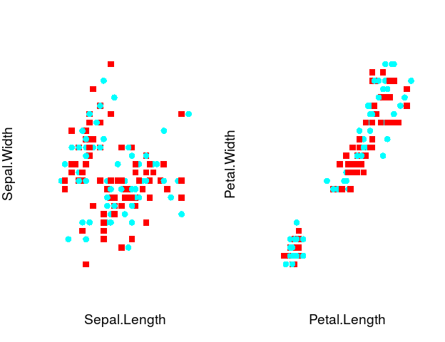

Anticlustering
==============

Anticlustering is used to create sets of elements that are as similar as possible (Späth 1986; Valev 1998). The better known twin of anticlustering is cluster analysis that is used to create sets where elements within each cluster are similar, but dissimilar from elements in other clusters. The `R` package `anticlust` provides functions to tackle anticlustering algorithmically.

Installation
------------

``` r
library("devtools") # if not available: install.packages("devtools")
install_github("m-Py/anticlust")
```

``` r
# load the package via
library("anticlust")
```

A quick start
-------------

The main function of the package is `anticlustering`. For most users, it should be sufficient to know this function. It takes as input a data matrix of features describing the elements that we want to assign to groups. In the data matrix, each row is an element, for example a person, picture, word, or a photo. Each column is a numeric variable describing one of the elements' features. The input may be an R `matrix` or `data.frame`. A single feature can be passed as a `vector`.

To illustrate the usage of the function, we use the classical iris data set describing the characteristics of 150 iris plants:

``` r
## Select only the numeric attributes
features <- iris[, -5]
nrow(features)
#> [1] 150
```

The first rows of the data set look as follows:

|  Sepal.Length|  Sepal.Width|  Petal.Length|  Petal.Width|
|-------------:|------------:|-------------:|------------:|
|           5.1|          3.5|           1.4|          0.2|
|           4.9|          3.0|           1.4|          0.2|
|           4.7|          3.2|           1.3|          0.2|
|           4.6|          3.1|           1.5|          0.2|
|           5.0|          3.6|           1.4|          0.2|
|           5.4|          3.9|           1.7|          0.4|

We now use the `anticlustering` function to create two similar groups of iris plants:

``` r
anticlusters <- anticlustering(features, K = 2, standardize = TRUE)
anticlusters
#>   [1] 2 1 2 1 1 1 2 2 1 2 1 1 1 2 2 1 2 1 1 1 1 1 1 1 2 2 2 1 2 1 2 2 1 2 1
#>  [36] 1 2 2 1 1 1 2 2 2 2 2 2 1 2 2 2 1 1 1 2 2 2 1 1 1 1 1 2 1 1 1 2 1 2 2
#>  [71] 2 2 2 1 2 2 1 2 2 2 2 1 2 1 1 1 2 1 2 1 1 2 1 2 2 1 2 1 2 1 2 1 1 2 2
#> [106] 2 2 1 1 2 2 1 1 2 1 1 2 1 2 1 2 2 1 2 1 1 1 2 1 2 2 2 2 1 2 1 1 1 1 2
#> [141] 1 1 2 1 2 2 2 1 2 1
table(anticlusters)
#> anticlusters
#>  1  2 
#> 75 75
```

Now, we wish to know how well the anticluster assignment worked. To get an intuition for how an anticluster looks like, we first plot the plants' characteristics by anticluster:

``` r
par(mfrow = c(1, 2))
pch <- 15:16
# plot_clusters is also a function of the anticlust package
plot_clusters(features[, 1:2], anticlusters, pch = pch) 
plot_clusters(features[, 3:4], anticlusters, pch = pch)
```



This looks rather chaotic, but it is probably what we want: We would expect a strong overlap in all of the plants' characteristics between the three anticlusters. In addition to visually inspecting the anticlustering plots, we probably want to investigate the descriptive statistics of the plants' characteristics by anticluster. Ideally, the distribution of plant characteristics should be the same for each anticluster. In the following, we find the means and standard deviations of each plant feature by anticluster:

| Statistic | Sepal.Length | Sepal.Width | Petal.Length | Petal.Width |  Anticluster|
|:----------|:-------------|:------------|:-------------|:------------|------------:|
| Mean      | 5.84         | 3.06        | 3.76         | 1.19        |            1|
|           | 5.85         | 3.05        | 3.76         | 1.21        |            2|
| SD        | 0.83         | 0.44        | 1.76         | 0.76        |            1|
|           | 0.83         | 0.43        | 1.78         | 0.77        |            2|

The anticlustering objective
----------------------------

In the example above, the `anticlustering` function established anticlusters that were very similar with regard to the mean of each plant feature. However, it was just a side effect that group means turned out to be similar -- the anticlustering method does not directly minimize differences in groups means. Instead, anticlustering employs two objectives that have been developed in the context of cluster analysis:

-   the k-means "variance" objective (Späth 1986; Valev 1998)
-   the cluster editing "distance" objective (Böcker and Baumbach 2013; Miyauchi and Sukegawa 2015; Grötschel and Wakabayashi 1989)

The k-means objective is given by the sum of the squared errors between cluster centers and individual data points (Jain 2010). The cluster editing objective is the sum of pairwise distances within anticlusters. Maximizing either of these objectives leads similar groups, i.e., anticlusters. Minimization of the same objectives leads to a clustering, i.e., elements are as similar as possible within a set and as different as possible between sets.

To vary the objective function, it is possible change the parameter `objective`. To apply anticluster editing, use `objective = "distance"`, which is also the default. To maximize the k-means variance objective, set `objective = "variance"`. In many cases, the results for the `"variance"` objective (k-means) and the `"distance"` objective (anticluster editing) will be quite similar:

``` r
anticlusters <- anticlustering(features, K = 2, standardize = TRUE,
                               objective = "variance")
print_table(features, anticlusters)
```

| Statistic | Sepal.Length | Sepal.Width | Petal.Length | Petal.Width |  Anticluster|
|:----------|:-------------|:------------|:-------------|:------------|------------:|
| Mean      | 5.85         | 3.06        | 3.76         | 1.20        |            1|
|           | 5.84         | 3.06        | 3.76         | 1.20        |            2|
| SD        | 0.84         | 0.46        | 1.79         | 0.76        |            1|
|           | 0.82         | 0.41        | 1.75         | 0.77        |            2|

Exact anticluster editing
-------------------------

Finding an optimal partitioning that maximizes the anticluster editing or variance objective is computationally demanding. For anticluster editing, the package `anticlust` still offers the possibility to find the best possible partition, relying on [integer linear programming](https://en.wikipedia.org/wiki/Integer_programming). This exact approach relies on a formulation developed by Grötschel and Wakabayashi (1989) that has been used to rather efficiently solve the cluster editing problem exactly (Böcker, Briesemeister, and Klau 2011). To obtain an optimal solution, a linear programming solver must be installed on the system. `anticlust` supports the commercial solvers [gurobi](https://www.gurobi.com/) and [CPLEX](https://www.ibm.com/analytics/cplex-optimizer) as well as the open source [GNU linear programming kit](https://www.gnu.org/software/glpk/glpk.html). The commercial solvers are generally faster. Researchers can install a commercial solver for free using an academic licence. To use any of the solvers from within `R`, one of the interface packages `gurobi` (is shipped with the software gurobi), [Rcplex](https://CRAN.R-project.org/package=Rcplex) or [Rglpk](https://CRAN.R-project.org/package=Rglpk) must also be installed.

To find the optimal solution, we have to set the arguments `method = "ilp"` and `preclustering = FALSE` and `objective = "distance"`:

``` r
anticlustering(features, K = 2, method = "ilp", preclustering = FALSE)
```

Note that this approach will only work for small problem sizes (&lt; 30 elements). We can increase the problem size that the integer linear programming approach can handle by setting the argument `preclustering = TRUE`. In this case, a cluster analysis is first performed, creating small groups of elements that are very similar. The preclustering finds pairs of similar stimuli if K = 2, triplets if K = 3, and so forth. Then, a restriction is enforced that precludes very similar elements to be assigned to the same set. This procedure is illustrated in the following plot for K = 2 and n = 10:


The preclustering restrictions improve the running time of the integer linear programming solver by a large margin (often 100x as fast). However, in some occasions, the restrictions prohibit the integer linear programming solver to find the very best partitioning, because this may be only obtained when some of the very similar preclustered elements are assigned to thethe same group. But in general, the solution is still very good and often optimal. This code can be used to employ integer linear programming under preclustering constraints.

``` r
anticlustering(features, K = 2, method = "ilp", preclustering = TRUE)
```

Random search
-------------

To solve larger problem instances that cannot be processed using integer linear programming, a heuristic method based on random sampling is available. Across a user-specified number of runs (specified via the argument `nrep`), each element is first randomly assigned to an anticluster and then the objective value is computed. In the end, the best assignment is returned as output. To activate the heuristic, set `method = "heuristic"`, which is also the default argument. When we set `preclustering = TRUE`, the random assignment is conducted under the restriction that preclustered elements cannot be part of the same anticluster.

How to procede
--------------

The help page of the `anticlustering` function (`?anticlustering`) provides more explanations of all of the parameters that can be adjusted. Currently, there is also a paper in preparation that will explain the theoretical background of the `anticlust` package in detail.

References
----------

Böcker, Sebastian, and Jan Baumbach. 2013. “Cluster Editing.” In *Conference on Computability in Europe*, 33–44. Springer.

Böcker, Sebastian, Sebastian Briesemeister, and Gunnar W Klau. 2011. “Exact Algorithms for Cluster Editing: Evaluation and Experiments.” *Algorithmica* 60 (2). Springer: 316–34.

Grötschel, Martin, and Yoshiko Wakabayashi. 1989. “A Cutting Plane Algorithm for a Clustering Problem.” *Mathematical Programming* 45 (1-3). Springer: 59–96.

Jain, Anil K. 2010. “Data Clustering: 50 Years Beyond K-Means.” *Pattern Recognition Letters* 31 (8). Elsevier: 651–66.

Miyauchi, Atsushi, and Noriyoshi Sukegawa. 2015. “Redundant Constraints in the Standard Formulation for the Clique Partitioning Problem.” *Optimization Letters* 9 (1). Springer: 199–207.

Späth, H. 1986. “Anticlustering: Maximizing the Variance Criterion.” *Control and Cybernetics* 15 (2): 213–18.

Valev, Ventzeslav. 1998. “Set Partition Principles Revisited.” In *Joint IAPR International Workshops on Statistical Techniques in Pattern Recognition (SPR) and Structural and Syntactic Pattern Recognition (SSPR)*, 875–81. Springer.
