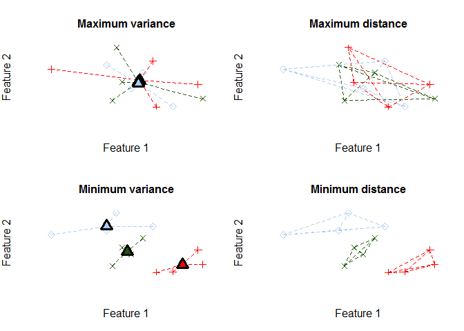

# anticlust

`anticlust` is an `R` package for »anticlustering«, a method to assign
elements to sets in such a way that the sets are as similar as possible
(Späth 1986; Valev 1998). The package `anticlust` was originally
developed to assign items to experimental conditions in experimental
psychology, but it can be applied whenever a user requires that a given
set of elements has to be partitioned into similar subsets. Currently,
the `anticlust` package offers the possibility to create subsets of
equal size. The package is still under active developement; expect 
changes and improvements before it will be submitted to CRAN.

## Installation

``` r
library("devtools") # if not available: install.packages("devtools")
install_github("m-Py/anticlust")
```

## Example

In this initial example, I use the main function `anticlustering()` to
create three similar sets of plants using the classical iris data set:

``` r
# load the package via
library("anticlust")

anticlusters <- anticlustering(
  iris[, -5],
  K = 3,
  objective = "variance",
  method = "exchange"
)

## The output is a vector that assigns a group (i.e, a number 
## between 1 and K) to each input element:
anticlusters
#>   [1] 1 1 1 1 2 2 2 3 2 3 3 3 2 1 3 2 1 2 3 2 3 2 1 2 3 2 2 1 3 3 2 2 3 1 1
#>  [36] 1 3 1 1 3 1 1 1 2 3 2 3 1 3 3 2 3 2 3 2 3 1 2 2 2 3 3 1 3 3 3 3 1 3 2
#>  [71] 1 2 2 1 1 1 3 2 2 2 1 2 3 2 1 2 1 3 1 2 2 1 2 2 1 2 1 1 2 3 3 3 2 1 2
#> [106] 2 3 3 3 2 3 3 3 3 3 1 2 2 1 1 1 1 2 1 3 1 1 2 1 3 1 1 2 3 3 1 2 1 1 1
#> [141] 1 3 3 2 3 3 3 2 1 2

## Each group has the same number of items:
table(anticlusters)
#> anticlusters
#>  1  2  3 
#> 50 50 50

## Compare the feature means by anticluster:
by(iris[, -5], anticlusters, function(x) round(colMeans(x), 2))
#> anticlusters: 1
#> Sepal.Length  Sepal.Width Petal.Length  Petal.Width 
#>         5.84         3.06         3.76         1.20 
#> -------------------------------------------------------- 
#> anticlusters: 2
#> Sepal.Length  Sepal.Width Petal.Length  Petal.Width 
#>         5.84         3.06         3.76         1.20 
#> -------------------------------------------------------- 
#> anticlusters: 3
#> Sepal.Length  Sepal.Width Petal.Length  Petal.Width 
#>         5.84         3.06         3.76         1.20
```

## How do I learn about anticlustering

This page contains a quick start on how to employ anticlustering using
the `anticlust` package. So, you should start by simply continuing to
read. More information is available via the following sources:

1.  The R help. The main function of the package is `anticlustering()`
    and the help page of the function (`?anticlustering`) is useful to
    learn more about anticlustering. It provides explanations of all
    function parameters and how they relate to the theoretical
    background of anticlustering.

2.  I created a repository on the [Open Science
    Framework](https://osf.io/cd5sr/) that includes materials for a
    better understanding of the anticlustering method. Currently, it
    contains the slides of a talk that I gave a the TeaP conference
    (Annual meeting of Experimental Psychologists) in London in April,
    2019. The slides can be retrieved [here](https://osf.io/jbthk/);
    they contain a visual illustration of the anticlustering method and
    example code for different applications.

3.  There is a paper in preparation that will explain the theoretical
    background of the `anticlust` package in detail.

4.  If you have any question on the anticlustering method and the
    `anticlust` package, I encourage you to contact me via email
    (<martin.papenberg@hhu.de>) or
    [Twitter](https://twitter.com/MPapenberg) or to open an issue on
    this Github repository.

## A quick start

As illustrated in the example above, we can use the function
`anticlustering()` to create similar sets of elements. The function
takes as input a data table describing the elements that should be
assigned to sets. In the data table, each row represents an element, for
example a person, word or a photo. Each column is a numeric variable
describing one of the elements’ features. The table may be an R `matrix`
or `data.frame`; a single feature can also be passed as a `vector`. The
number of groups is specified through the argument `K`.

### The anticlustering objective

To measure set similarity, `anticlust` may employ one of two measures of
set similarity that have been developed in the context of cluster
analysis:

  - the k-means “variance” objective (Späth 1986; Valev 1998)
  - the cluster editing “distance” objective (Böcker and Baumbach 2013;
    Miyauchi and Sukegawa 2015; Grötschel and Wakabayashi 1989)

The k-means objective is given by the sum of the squared distances
between cluster centers and individual data points (Jain 2010). The
cluster editing objective is the sum of pairwise distances within each
anticluster. The following plot illustrates both objectives for 12 that
are assigned to three sets; each element is described by two numeric
features, displayed as the x- and
y-axis:



The lines connecting the dots illustrate the distances that enter the
objective functions. For anticluster editing (“distance” objective),
lines are drawn between pairs of elements within the same anticluster.
For k-means anticlustering (“variance” objective), lines are drawn
between each element and the cluster centroid. Minimization creates two
distinct clusters of elements, whereas maximization leads to a strong
overlap of the three sets. When we use the objectives for the
anticlustering application, the distance objective maximizes the average
similarity between elements in different sets, whereas the k-means
objective tends to maximize the similarity of the cluster centers.

To vary the objective function in the package `anticlust`, we may change
the parameter `objective`. To apply anticluster editing, use `objective
= "distance"` (this is also the default). To maximize the k-means
variance objective, set `objective = "variance"`.

``` r

## Example code for varying the objective:
anticlustering(
  features, 
  K = 3, 
  objective = "distance"
)

anticlustering(
  features, 
  K = 3, 
  objective = "variance"
)
```

### Exact anticluster editing

Finding an optimal assignment of elements to sets that maximizes the
anticluster editing or variance objective is computationally demanding.
For anticluster editing, the package `anticlust` still offers the
possibility to find the best possible assignment, relying on [integer
linear programming](https://en.wikipedia.org/wiki/Integer_programming).
This exact approach employs a formulation developed by Grötschel and
Wakabayashi (1989), which has been used to rather efficiently solve the
cluster editing problem (Böcker, Briesemeister, and Klau 2011). To
obtain an optimal solution, a linear programming solver must be
installed on your system; `anticlust` supports the commercial solvers
[gurobi](https://www.gurobi.com/) and
[CPLEX](https://www.ibm.com/analytics/cplex-optimizer) as well as the
open source [GNU linear programming
kit](https://www.gnu.org/software/glpk/glpk.html). The commercial
solvers are generally faster. Researchers can install a commercial
solver for free using an academic licence. To use any of the solvers
from within `R`, one of the interface packages `gurobi` (is shipped with
the software gurobi),
[Rcplex](https://CRAN.R-project.org/package=Rcplex) or
[Rglpk](https://CRAN.R-project.org/package=Rglpk) must also be
installed.

To find the optimal solution, we have to set the argument `method =
"ilp"`:

``` r
## Code example for using integer linear programming:
anticlustering(
  features, 
  K = 2, 
  method = "ilp",
  objective = "distance" # "variance" does not work with ILP method
)
```

The “variance” objective cannot by optimized to optimality using integer
linear programming. Check out the help page for the `anticlust` function
`generate_partitions` (`?generate_partitions`) to see how k-means
anticlustering can nevertheless be solved optimally using complete
enumeration (only feasible for small N).

### Preclustering

The exact integer linear programming approach will only work for
moderate problem sizes. We can increase the problem size that can be
handled by setting the argument `preclustering = TRUE`. In this case, an
initial cluster editing is performed, creating small groups of elements
that are very similar. The preclustering step identifies pairs of
similar stimuli if K = 2, triplets if K = 3, and so forth. After this
preclustering, a restriction is enforced to the integer linear program
that precludes very similar elements to be assigned to the same set.

The preclustering restrictions improve the running time of the integer
linear programming solver by a large margin (often 100x as fast) because
many possible assignment are rendered illegal; the integer linear
programming solver is smart and disregards these assignments from the
space of feasible solutions In some occasions, these restrictions
prohibit the integer linear programming solver to find the best solution
because this may be only obtained when some of the preclustered elements
are assigned to the same anticluster. However, in general, the solution
is still very good and often optimal. This code can be used to employ
integer linear programming under preclustering constraints.

``` r
## Code example using ILP and preclustering:
anticlustering(
  features, 
  K = 2, 
  method = "ilp", 
  objective = "distance",
  preclustering = TRUE
)
```

### Heuristic anticlustering

In addition to the exact approach—that is only feasible for small N—the
`anticlust` package may employ two heuristic approaches. The first
option is repeated random sampling: Across a specified number of runs,
anticlusters are assigned randomly. In the end, the assignment that
maximized set similarity is returned. The second approach is an exchange
method: Building on an initial random assignment, items are swapped
systematically in such a way that each swap improves set similarity by
the largest amount that is possible (cf. Späth, 1986). Random sampling
is recommended when the objective is “distance” (cluster editing). The
exchange method is recommended when the objective is “variance”
(k-means). The following code contains examples of how to use the
heuristic methods:

``` r
## Code example using random sampling
anticlustering(
  features, 
  K = 2, 
  method = "sampling",
  objective = "distance" 
)

## Random sampling may also use preclustering (this often improves the
## solution):
anticlustering(
  features, 
  K = 2, 
  method = "sampling",
  objective = "distance",
  preclustering = TRUE
)

## Code example using the exchange method
anticlustering(
  features, 
  K = 2, 
  method = "exchange",
  objective = "variance",
)
```

### Categorical constraints

Sometimes, it is required that sets are not only similar with regard to
some numeric variables, but we also want to ensure that each set
contains an equal number of elements of a certain category. Coming back
to the initial iris data set, we may want to require that each set has a
balanced number of plants of the three iris species. To this end, we can
use the argument `categories` as follows:

``` r
anticlusters <- anticlustering(
  iris[, -5],
  K = 3,
  objective = "variance",
  method = "exchange",
  categories = iris[, 5]
)
```

## References

<div id="refs" class="references">

<div id="ref-bocker2013">

Böcker, Sebastian, and Jan Baumbach. 2013. “Cluster Editing.” In
*Conference on Computability in Europe*, 33–44. Springer.

</div>

<div id="ref-bocker2011">

Böcker, Sebastian, Sebastian Briesemeister, and Gunnar W Klau. 2011.
“Exact Algorithms for Cluster Editing: Evaluation and Experiments.”
*Algorithmica* 60 (2): 316–34.

</div>

<div id="ref-grotschel1989">

Grötschel, Martin, and Yoshiko Wakabayashi. 1989. “A Cutting Plane
Algorithm for a Clustering Problem.” *Mathematical Programming* 45
(1-3): 59–96.

</div>

<div id="ref-jain2010">

Jain, Anil K. 2010. “Data Clustering: 50 Years Beyond K-Means.” *Pattern
Recognition Letters* 31 (8): 651–66.

</div>

<div id="ref-miyauchi2015">

Miyauchi, Atsushi, and Noriyoshi Sukegawa. 2015. “Redundant Constraints
in the Standard Formulation for the Clique Partitioning Problem.”
*Optimization Letters* 9 (1): 199–207.

</div>

<div id="ref-spath1986">

Späth, H. 1986. “Anticlustering: Maximizing the Variance Criterion.”
*Control and Cybernetics* 15 (2): 213–18.

</div>

<div id="ref-valev1998">

Valev, Ventzeslav. 1998. “Set Partition Principles Revisited.” In *Joint
IAPR International Workshops on Statistical Techniques in Pattern
Recognition (SPR) and Structural and Syntactic Pattern Recognition
(SSPR)*, 875–81. Springer.

</div>

</div>
